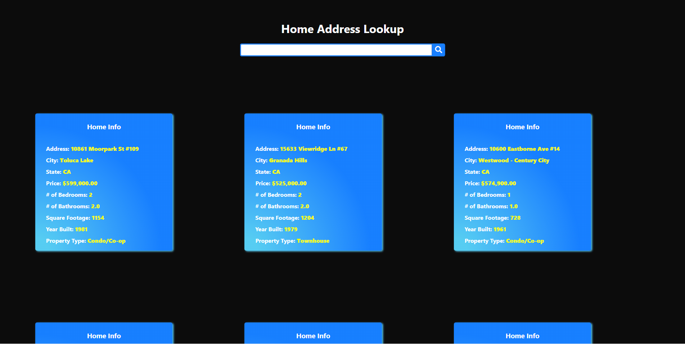
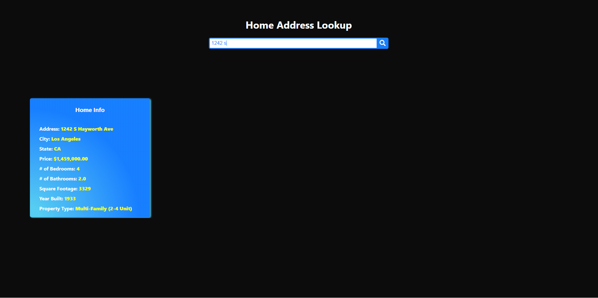

# Home Address Lookup

Home address lookup is an application that parses through a csv of homes downloaded from redfin.com, displays the home info in tiles, and has a search bar that will return homes with an address related to the search term. 
Tiles will be displayed on page load. Clicking on a tile will open up the home on https://www.redfin.com in a new tab.


# Run Locally

Clone the project

```bash
  git clone https://github.com/DesmonFur/HomeSearch.git
```

Go to the project directory

```bash
  cd HomeSearch
```

Install dependencies

```bash
  npm install
```

## Before Running Application

Navigate to this link: https://www.redfin.com/city/11203/CA/Los-Angeles

Near the bottom of the page right above the pagination you’ll see something like Viewing page 1 of 9 (Download All) - Click “Download All” 

Place csv file into assets folder located in HomeSearch root directory.

Start the server

```bash
  npm run start-server
```

Start React frontend

```bash
  npm run start
```
## Environment Variables

To run this project, you will need to add the following environment variables to a .env file

`SERVER_PORT` 


  
## Screenshots
  





  
